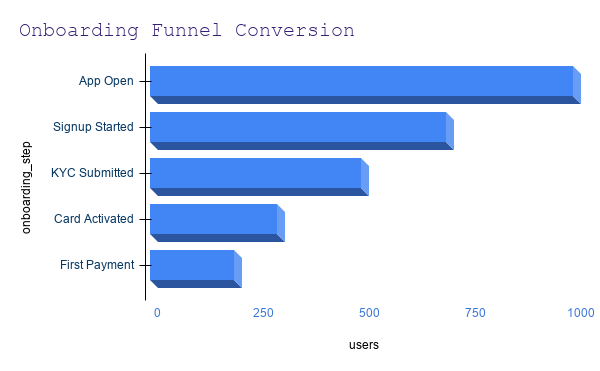

# Product Analytics Case Study: User Funnel & Retention Analysis

## Overview
This project simulates a product analytics workflow for a fintech-style application. The focus is on understanding user behaviour during onboarding, identifying friction points, and defining metrics that guide product decisions.

## Business Problem
Users drop off during onboarding. The goal was to identify where users leave, measure retention, and suggest improvements to increase conversion and engagement.

## Key Questions
- Where do users drop off in the onboarding funnel?
- What is the onboarding completion rate?
- How many users return after signup?
- Which features are most and least used?
- What should the product team improve next?

## Metrics Defined
- Onboarding conversion rate
- Step-to-step drop-off rate
- Day 1 retention
- Day 7 retention
- Feature adoption rate

## Analysis Performed

### 1. Funnel Analysis
- Measured user progression across onboarding steps
- Identified highest drop-off points

### 2. Retention Analysis
- Evaluated user activity after signup
- Compared Day 1 and Day 7 retention

### 3. Feature Adoption
- Analyzed which features users interact with most
- Identified underutilized features

## Key Insights
- Significant drop-off observed at onboarding step 2
- Retention declines sharply after initial usage
- A small number of features drive majority of engagement

## Recommendations
- Simplify onboarding flow at high drop-off step
- Introduce onboarding guidance or progress indicators
- Run A/B test on shorter onboarding flow
- Improve visibility of underused features

## Tech Stack
SQL, Python, Power BI

## Project Structure
- funnel_analysis.sql
- retention_analysis.sql
- feature_adoption.sql

## Outcome
Demonstrates product analytics thinking using SQL-driven analysis, KPI design, and actionable insights aligned with product decision-making.

## Product Thinking
This analysis focuses not only on identifying patterns, but on translating data into clear product decisions that improve user experience and business outcomes.

Highest drop-off occurs between "App Open" and "Signup Started", indicating onboarding friction at early stages. This suggests the need for simplification or guided onboarding to improve conversion.
